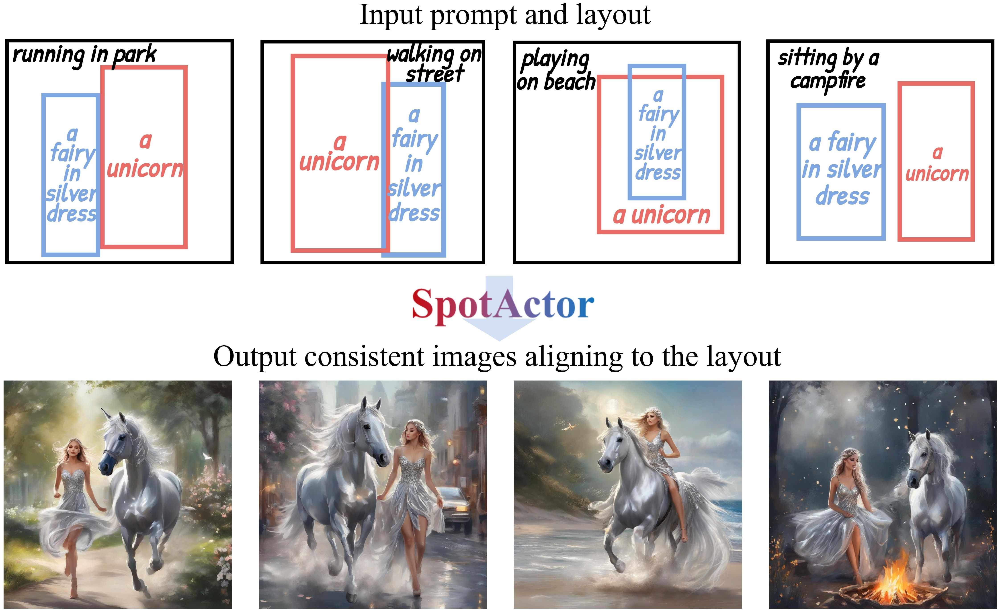

# SpotActor: Training-Free Layout-Controlled Consistent Image Generation

<p align="center">
  <strong>AAAI 2025</strong>
</p>

<p align="center">
  <a href="https://scholar.google.com/citations?hl=en&user=zQnTBEoAAAAJ">Jiahao Wang</a><sup>1,2</sup>&nbsp;&nbsp;
  <a href="https://gr.xjtu.edu.cn/web/yancaixia">Caixia Yan</a><sup>1</sup>&nbsp;&nbsp;
  <a href="https://gr.xjtu.edu.cn/web/zhangwzh123/">Weizhan Zhang</a><sup>1</sup>&nbsp;&nbsp;
  <a href="https://scholar.google.com/citations?user=GBnV3HIAAAAJ&hl=en&oi=ao">Haonan Lin</a><sup>1</sup>&nbsp;&nbsp;
  <a href="https://scholar.google.com/citations?hl=en&user=VSRnUiUAAAAJ">Mengmeng Wang</a><sup>3,4</sup><br>
  <a href="https://openreview.net/profile?id=~Guang_Dai1">Guang Dai</a><sup>4</sup>&nbsp;&nbsp;
  <a href="https://gr.xjtu.edu.cn/web/gongtl/home">Tieliang Gong</a><sup>1</sup>&nbsp;&nbsp;
  <a href="https://openreview.net/profile?id=~Hao_Sun15">Hao Sun</a><sup>5</sup>&nbsp;&nbsp;
  <a href="https://scholar.google.com/citations?user=z5SPCmgAAAAJ&hl=en&oi=ao">Jingdong Wang</a><sup>6</sup>
</p>

<p align="center">
  <sup>1</sup>Xi'an Jiaotong University&nbsp;&nbsp;
  <sup>2</sup>State Key Laboratory of Communication Content Cognition<br>
  <sup>3</sup>Zhejiang University of Technology&nbsp;&nbsp;
  <sup>4</sup>SGIT AI Lab&nbsp;&nbsp;
  <sup>5</sup>China Telecom&nbsp;&nbsp;
  <sup>6</sup>Baidu
</p>

<p align="center">
  <a href="https://arxiv.org/abs/2409.04801"></a>&nbsp;&nbsp;
  <a href="https://johnneyWang.github.io/SpotActor"></a>
</p>

<p align="center">
  
</p>

> SpotActor, given bounding boxes and text prompts of subject and plot descriptions, generates high-quality images where subjects align to the layout as well as share a consistent appearance.

---

## Highlights

- **Training-Free**: No additional training or fine-tuning required — operates purely at inference time.
- **Multi-Object Support**: Generate scenes with multiple subjects, each placed in specified bounding boxes.
- **Identity Consistency**: Subjects maintain their appearance across different scenes via cross-batch self-attention sharing (RISA).
- **Layout Control**: Dual guidance (backward loss + forward re-weighting via SFCA) ensures objects appear at designated positions.
- **Two-Stage Protocol**: Source → Target generation enables strong consistency anchoring.
- **SDXL Compatible**: Built on Stable Diffusion XL for high-quality 1024×1024 outputs.

---

## Abstract

Text-to-image diffusion models significantly enhance the efficiency of artistic creation with high-fidelity image generation. However, in typical application scenarios like comic book production, they can neither place each subject into its expected spot nor maintain the consistent appearance of each subject across images. For these issues, we pioneer a novel task, **Layout-to-Consistent-Image (L2CI)** generation, which produces consistent and compositional images in accordance with the given layout conditions and text prompts. To accomplish this challenging task, we present a new formalization of dual energy guidance with optimization in a dual semantic-latent space and thus propose a training-free pipeline, **SpotActor**, which features a layout-conditioned backward update stage and a consistent forward sampling stage. In the backward stage, we innovate a nuanced layout energy function to mimic the attention activations with a sigmoid-like objective. While in the forward stage, we design **Regional Interconnection Self-Attention (RISA)** and **Semantic Fusion Cross-Attention (SFCA)** mechanisms that allow mutual interactions across images.

---

## Method Overview

SpotActor operates through attention manipulation in the UNet denoising process:

1. **Layout Backward Guidance**: Optimizes latents by computing MSE loss between cross-attention maps and target bounding box masks.
2. **Layout Forward Guidance (SFCA)**: Re-weights cross-attention to spatially concentrate object tokens within their bounding boxes.
3. **Consistency Forward Guidance (RISA)**: Shares self-attention keys/values across batch items (scenes) with spatial masking to maintain identity.

---

## Installation

### Option A: pip (from source)

```bash
pip install -e .
```

### Option B: conda

```bash
conda env create -f environment/environment.yml
conda activate spotactor
```

### Model Download

SpotActor uses Stable Diffusion XL as the base model:

```bash
# Automatic download from HuggingFace (default)
# Or specify a local path in the config YAML:
#   model:
#     path: "/path/to/your/sdxl-base"
```

---

## Quick Start

### Generation

```bash
python scripts/generate.py --config configs/demo.yaml
```

---

## Project Structure

```
SpotActor/
├── spotactor/                   # Core library
│   ├── __init__.py             # Package entry point
│   ├── pipeline/               # Pipeline implementations
│   │   ├── __init__.py
│   │   └── spotactor_xl_pipeline.py   # Main SDXL pipeline
│   ├── attention/              # Attention manipulation
│   │   ├── __init__.py
│   │   ├── manipulator.py     # Mode switching & spatial masks (RISA)
│   │   └── processor.py       # Custom attention processor (SFCA)
│   └── utils/                  # Utility functions
│       ├── __init__.py
│       └── adaptive_scheduler.py  # Geometry-aware hyperparameter tuning
├── scripts/                    # Execution scripts
│   └── generate.py            # Config-driven generation entry point
├── configs/                    # YAML configurations
│   └── demo.yaml              # Example case configuration
├── environment/                # Environment setup
│   └── environment.yml
├── assets/                     # Documentation assets
├── pyproject.toml              # Package metadata & dependencies
├── README.md
├── LICENSE
└── .gitignore
```

---

## Configuration

SpotActor uses a layered YAML configuration system:

**Case config** — Defines subjects, prompts, bounding boxes, and seeds

### Config File Structure

```yaml
# Case config example (configs/examples/cat_dog.yaml)
subjects: ["cat", "dog"]
central_prompt: "A ginger cat and a brown dog, digital painting"

source:
  scene: "standing together"
  bbox:
    - [0.05, 0.20, 0.45, 0.85]   # cat
    - [0.55, 0.20, 0.95, 0.85]   # dog
  seed: 1001

targets:
  - scene: "running in park"
    bbox:
      - [0.10, 0.15, 0.45, 0.80]
      - [0.55, 0.20, 0.90, 0.85]
    seed: 2001
```

### SpotActor Hyperparameters

| Parameter | Default | Description |
|-----------|---------|-------------|
| `layout_guidance_steps` | 1 | Number of denoising steps with backward layout optimization |
| `consistent_guidance_steps` | 20 | Steps with cross-batch consistency guidance |
| `backward_iter_per_step` | 30 | Max optimization iterations per backward step |
| `scale_factor` | 300 | Layout loss scaling factor |
| `loss_thres` | 0.2 | Early-stop threshold for layout loss |
| `semantic_rescale` | 0.003 | Prompt embedding gradient scale |
| `lambda_f` | 0.5 | Forward layout guidance weight |

### Bounding Box Format

Bounding boxes are specified as normalized coordinates `[x_min, y_min, x_max, y_max]` where each value is in `[0, 1]`.

```python
# Example: Two objects side by side
bboxes = [
    [0.05, 0.20, 0.45, 0.85],  # Object 1 (left)
    [0.55, 0.20, 0.95, 0.85],  # Object 2 (right)
]
```

---

## Usage as Library

```python
import torch
from spotactor import SpotActorXLPipeline

# Load pipeline
pipe = SpotActorXLPipeline.from_pretrained(
    "stabilityai/stable-diffusion-xl-base-1.0",
    torch_dtype=torch.float16, variant="fp16"
)
pipe = pipe.to("cuda")

# Stage 1: Generate source
source_config = {
    "is_source": True,
    "source_latent": None,
    "layout_guidance_steps": 1,
    "consistent_guidance_steps": 0,
    "backward_iter_per_step": 30,
    "scale_factor": 300,
    "loss_thres": 0.2,
    "semantic_rescale": 0.003,
    "lambda_f": 0,
    "inference_steps": 30,
    "obj_tokens": [["cat", "dog"]],
    "sce_tokens": [["standing", "together"]],
    "bboxes": [[[0.05, 0.2, 0.45, 0.85], [0.55, 0.2, 0.95, 0.85]]],
    "prompt": ["A ginger cat and a brown dog, standing together"],
}

images, latent = pipe(
    prompt=source_config["prompt"],
    negative_prompt=["low quality"],
    num_inference_steps=30,
    guidance_scale=5.0,
    generator=torch.Generator("cuda").manual_seed(42),
    return_dict=False,
    extra_config=source_config,
)

# Stage 2: Generate target with consistency
target_config = {
    **source_config,
    "is_source": False,
    "source_latent": latent.to("cuda"),
    "consistent_guidance_steps": 20,
    "lambda_f": 0.5,
    "obj_tokens": [["cat", "dog"], ["cat", "dog"]],
    "sce_tokens": [["standing", "together"], ["running", "in", "park"]],
    "bboxes": [
        [[0.05, 0.2, 0.45, 0.85], [0.55, 0.2, 0.95, 0.85]],
        [[0.10, 0.15, 0.45, 0.80], [0.55, 0.20, 0.90, 0.85]],
    ],
    "prompt": [
        "A ginger cat and a brown dog, standing together",
        "A ginger cat and a brown dog, running in park",
    ],
}

target_images, _ = pipe(
    prompt=target_config["prompt"],
    negative_prompt=["low quality"] * 2,
    num_inference_steps=30,
    guidance_scale=5.0,
    generator=torch.Generator("cuda").manual_seed(123),
    return_dict=False,
    extra_config=target_config,
)
# target_images[1] is the consistent target image
```

---

## Citation

If you find this work useful, please consider citing:

```bibtex
@inproceedings{spotactor,
  author    = {Jiahao Wang and Caixia Yan and Weizhan Zhang and 
               Haonan Lin and Mengmeng Wang and Guang Dai and 
               Tieliang Gong and Hao Sun and Jingdong Wang},
  title     = {SpotActor: Training-Free Layout-Controlled 
               Consistent Image Generation},
  booktitle = {AAAI Conference on Artificial Intelligence},
  year      = {2025},
}
```

---

## Acknowledgements

This work is built on top of the following open-source projects:

- [Stable Diffusion XL](https://huggingface.co/stabilityai/stable-diffusion-xl-base-1.0)
- [Diffusers](https://github.com/huggingface/diffusers)
- [Transformers](https://github.com/huggingface/transformers)

---

## License

This project is licensed under the Apache License 2.0. See [LICENSE](LICENSE) for details.
